<a href="https://github.com/banbanzhige/ai-goofish-monitor-QB" title="ai-goofish-monitor-QB">
  
</a>


# 咸鱼智能监控机器人
基于 Playwright 和 AI 的闲鱼多任务实时监控工具机器人，提供完整的 Web 管理界面，调用ai帮助用户过滤商品链接，自动个性化挑选商品，支持多种通知方式即时触达。
基于原仓库地址代码：[Usagi-org/ai-goofish-monitor](https://github.com/Usagi-org/ai-goofish-monitor) 大量修改优化代码与操作逻辑调整到更舒适的使用体验风格。
- 本项目仅供学习和技术研究使用，请勿用于非法用途。
- 请遵守闲鱼的用户协议和robots.txt规则，不要进行过于频繁的请求，以免对服务器造成负担或导致账号被限制。


## ✨ 核心功能

- **Web管理界面**：提供直观的Web UI，方便配置和管理
- **定时商品监控**：定时监控咸鱼平台上的商品信息与新上
- **高度可定制**: 每个监控任务均可配置独立的关键词、价格范围、个性需求，筛选条件和AI分析指令 (Prompt)。
- **AI智能分析**：利用AI自动分析商品信息，结合商品图文和卖家画像进行深度分析，精准筛选符合条件的商品，并且给出个性化建议
- **多种通知方式**：企业微信群机器人、企业微信应用通知、支持Ntfy、Gotify、Bark、Telegram等多种通知渠道
- **多任务管理**：支持配置多个监控任务，每个任务可以设置不同的关键词、价格范围等、支持并发运行
- **灵活的调度**：支持定时任务配置，可自定义监控频率
- **Docker 一键部署**: 提供 `docker-compose` 配置，实现开箱即用


# 📸 截图展示
<div align="center" style="margin: 2em 0;">
  
  <p style="font-size: 0.9em; color: #555; margin-top: 0.5em;">
    新任务管理界面
  </p>
</div>

<div align="center" style="margin: 2em 0;">
  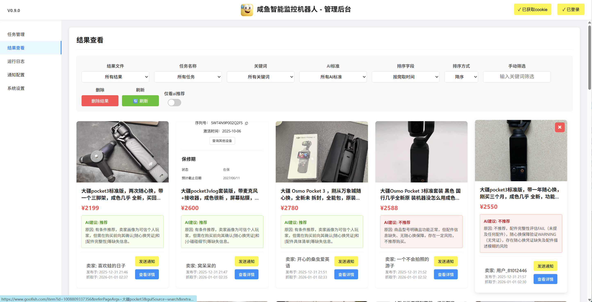
  <p style="font-size: 0.9em; color: #555; margin-top: 0.5em;">
    新结果管理界面
  </p>
</div>


| 微信应用通知渠道效果 | 微信群机器人通知渠道效果 | Telegram通知渠道效果 |
|:---:|:---:|:---:|
| 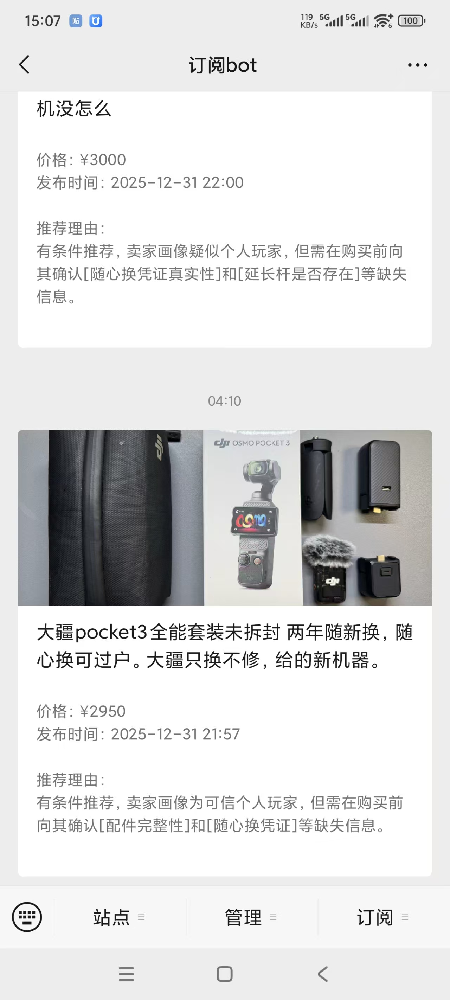 |  |  |


# token消耗

<details>

<summary>1.token消耗优化</summary>

本项目对ai调用api的token使用进行过优化，如果模型条件允许推荐开启`发送URL格式图片`将大大降低token使用情况


</details>

<details>

<summary>2.token消耗预期</summary>

截止2026年1月6日，在启用`发送URL格式图片`后这是优化使用豆包1.8模型20个产品分析token使用量情况
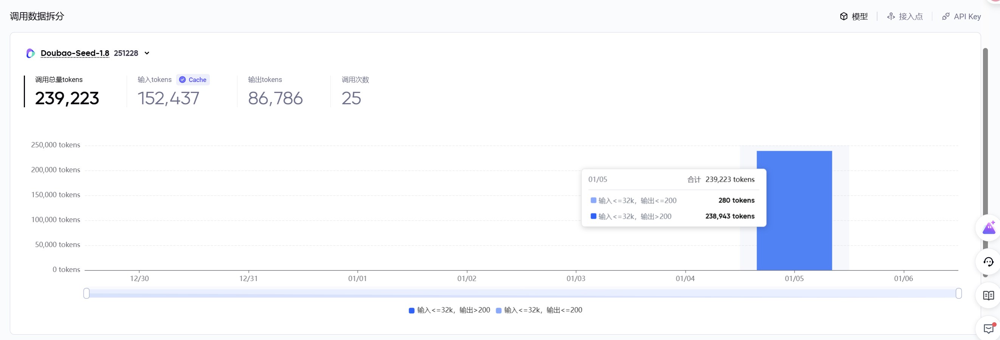
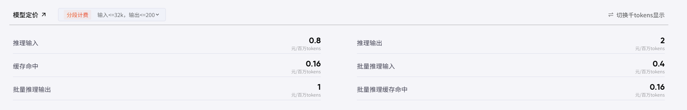
根据测算可得出20个产品分析预估模型调用费用约0.2元人民币，成本消耗控制十分可观

0
</details>

# 🆕 新特性
**近期更新：**
<details open>
<summary>v0.9.6 更新日志 - 2026-01-16</summary>

  <ul>
    <li><strong>新增定时任务管理界面</strong>：添加了独立的定时任务执行列表，支持查看任务执行顺序、计算并显示下次执行时间。</li>
    <li><strong>Cron 表达式在线编辑</strong>：支持直接在列表中修改 Cron 表达式，并在修改后自动同步更新到任务配置。</li>
    <li><strong>更灵活的任务控制</strong>：新增了跳过本次任务、立即执行任务、取消任务（保留配置但关闭启用）的操作功能。</li>
    <li><strong>重构项目架构</strong>：将 web_server.py 拆分为 main.py, auth.py, scheduler.py 等 9 个独立模块，大幅提升代码可维护性。</li>
    <li><strong>统一配置与规范管理</strong>：统一了配置管理逻辑，新增了项目规范文档，规范了代码结构。</li>
    <li><strong>功能增强与修复</strong>：
      <ul>
        <li>整合系统日志到控制台输出，方便调试查看。</li>
        <li>添加了任务开始和结束的通知推送，增加了统计计数。</li>
        <li>修复了启用按钮开关报错、创建表达式未载入任务等 bug。</li>
        <li>升级了新闲鱼登录状态提取器，支持捕获更完整的浏览器环境信息。</li>
      </ul>
    </li>
  </ul>
</details>


<details>
<summary>v0.9.5更新日志-2026-01-04</summary>

  <ul>
    <li>修改了项目中部分具有争议词汇替换为中性、合规的表述，详见<a href="archive/争议词汇修改落地实施文档.md">争议词汇修改文档.md</a></li>
    <li>修复了任务运行中，通知没有检查通知渠道是否开启通知的问题，现在自动通知发送前会检查渠道是否开启通知，任务过程中关闭或开启通知渠道都能正确的通知了</li>
    <li>修复了自动触发发送的企业微信群机器人图文消息会出现标题，价格时间等文案信息不对的情况</li>
    <li>添加了完成任务后会推送一条通知消息到通知渠道</li>
    <li>修复了没有手动任务在结束任务后没有更新任务状态的bug，这个bug会导致任务面板上看到的任务一直是在执行中，但是后台任务已经其实结束了</li>
    <li>添加了测试任务完成通知按钮</li>
    <li>现在通知配置和系统设置的Switch开关都能自动保存设置了</li>
    <li>优化了筛选框的文字显示去除了没必要的后缀提高了可读性</li>
    <li>优化了单独删除卡片时会删除错误的卡片的问题</li>
  </ul>
</details>


<details>


<summary>v0.9.2更新日志-2026-01-02</summary>
  <ul>
    <li>优化了通知模板尽量满足图文通知需求</li>
    <li>添加数据筛滤机制，解决部分情况下前端按钮卡死问题</li>
    <li>对自动登录程序添加追踪与限制，避免重复触发占用资源</li>
    <li>优化修改了部分文案</li>
    <li>添加了渠道通知开关</li>
  </ul>

  <p></p> 

  
  
  
</details>


<details>
<summary>v0.9.0更新日志-2026-01-01</summary>
  <ul>
    <li>元旦快乐</li>
    <li>添加了自动获取cookie登录按钮，优化了login.py的登录逻辑</li>
    <li>在搜索结果添加了手动搜索，并且能高光显示搜索匹配内容</li>
    <li>优化了管理界面的UI视觉效果，现在更好看了</li>
    <li>添加了版本号，与docker版本号接轨</li>
    <li>优化了start_web_server.bat的字体颜色和添加了版本号，引导更清晰了</li>
    <li>优化了微信群机器人等渠道通知逻辑：如果选择了发送手机链接则微信群机器人不发送电脑端链接</li>
    <li>商品卡如果没有抓取到图片则选择默认logo</li>
    <li>卖家名字过长的分行到第二行，避免挤压到发送通知</li>
    <li>修改了scraper.py和ai_handler.py里的冗余通知代码，通知全部转移到专用的notifier里</li>
  </ul>

  <p></p> <!-- 加一个空行，让列表和图片之间有间隔 -->

  
  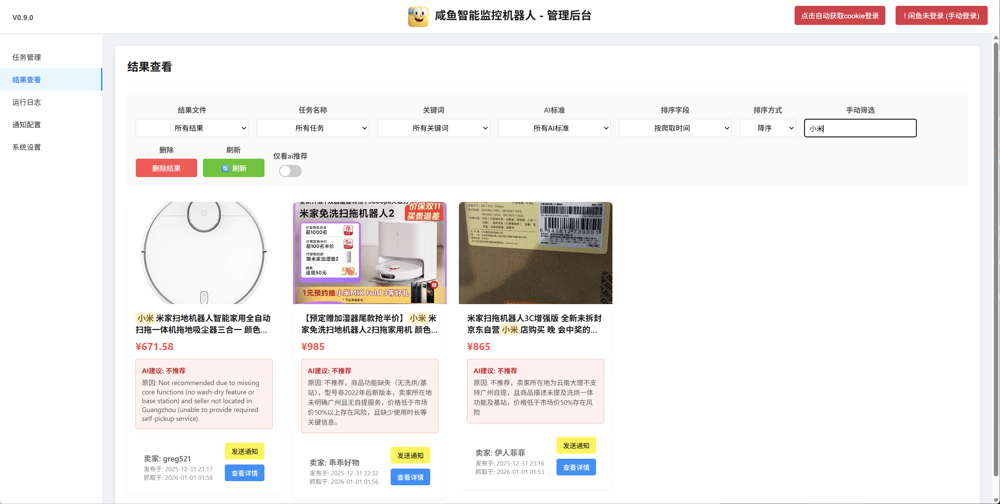
  
</details>

**归档日志**

我针对了原版goofish代码做出了一些优化，对我个人而言使用上更加顺畅，逻辑上更加清晰
<details>
<summary>📋任务管理界面：优化了整体ui排版，拆分了运行逻辑，增加了更多的任务状态指示与操作，减少了任务阻塞。现在可以复制任务，详细定制每条任务的ai筛选标准了</summary>

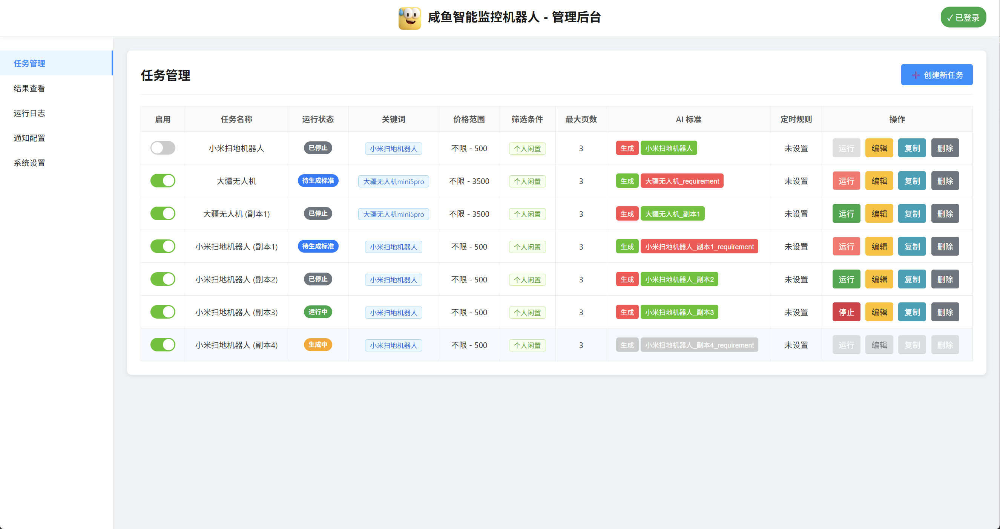
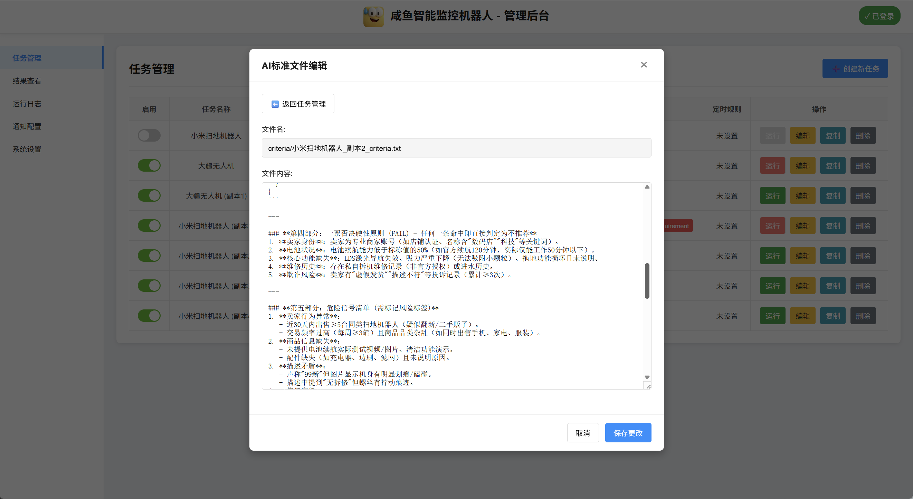
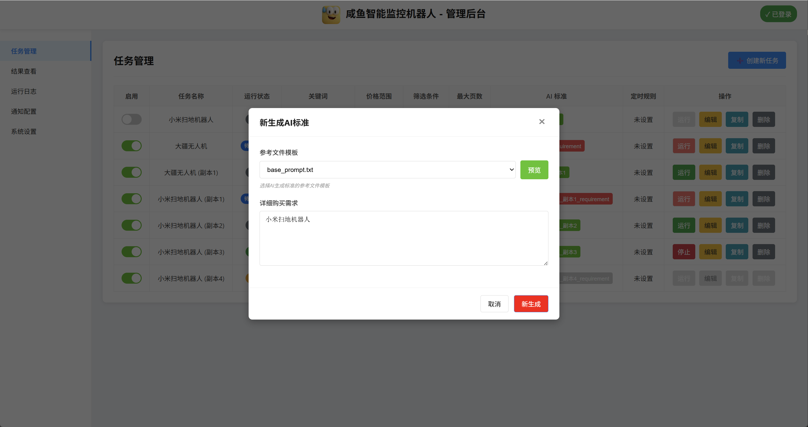
</details>
<details>
<summary>🎯结果查看界面：添加了更多结果可选筛选项，添加了手动发送通知到通知渠道，现在可以更详细的管理所有商品结果了</summary>


</details>

<details>
<summary>📊运行日志界面：添加了更多结果可选筛选项，添加了手动发送通知到通知渠道，现在可以更详细的管理所有商品结果了</summary>

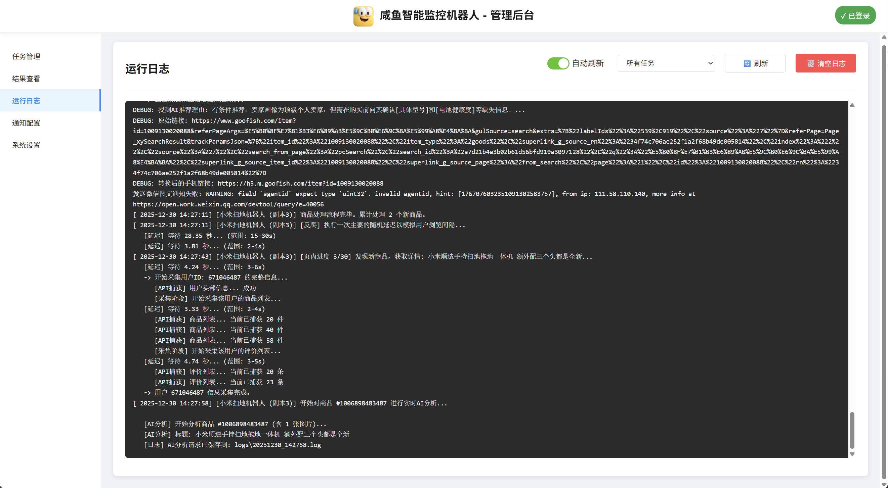
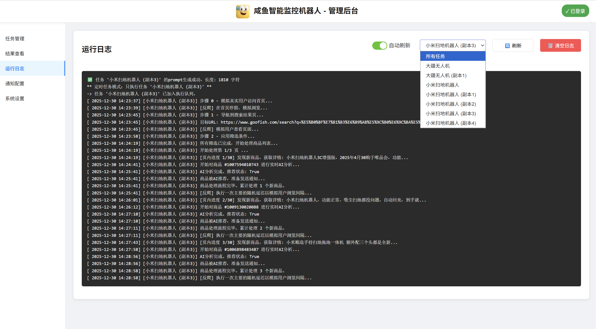

</details>

<details>
<summary>📱通知配置界面：拆分优化了通知模块，把通知配置界面也单独拎到导航栏，添加在通知中手机版5H链接，方便在通信软件如微信中直接打开移动版咸鱼，并且添加了企业微信应用渠道支持，添加了测试通知</summary>

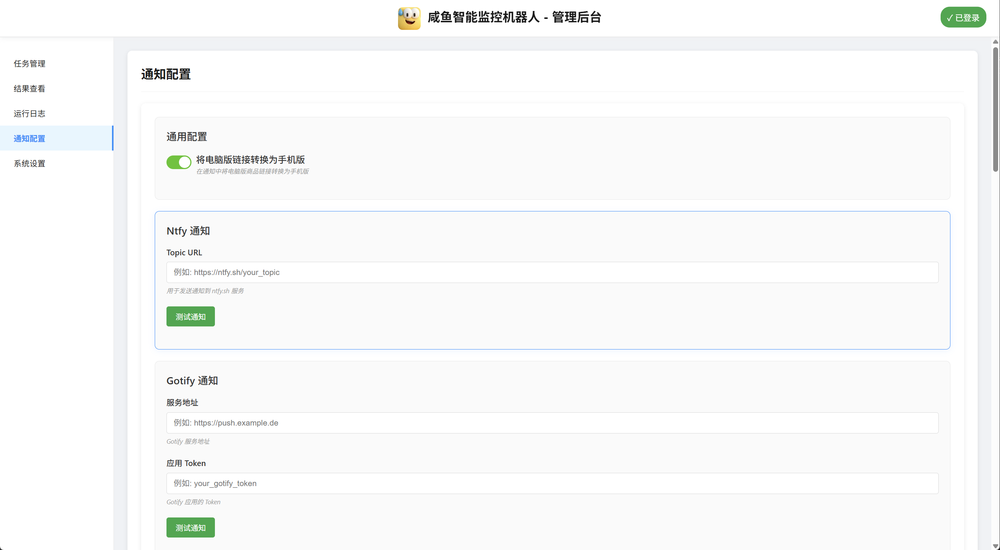


</details>


<details>
<summary>🖥️系统设置界面：优化了.env与系统同步逻辑，web里添加了更多可选的环境设置，并且双向保存同步了，对docker用户更加友好。现在可以直接在系统管理里管理Prompt实现了核心ai标准的增删改查工作，能更方便配置自定义个性化ai需求了。</summary>

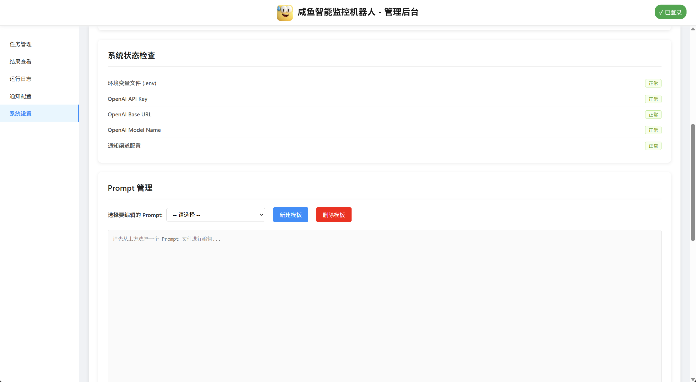
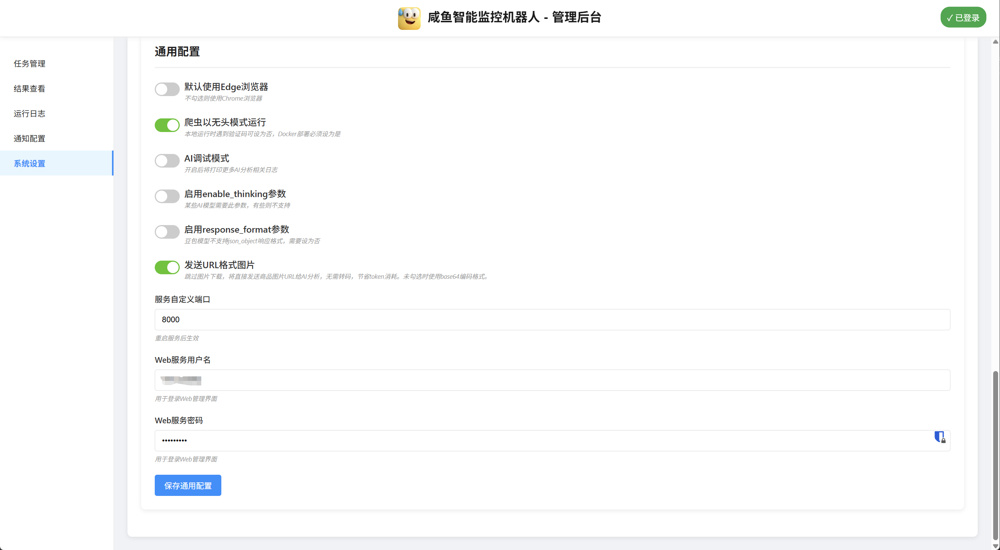

</details>


## 🚀核心流程

-  **自然语言定制推荐**：每个任务都可以单独给 ai 分析配备独立的判断逻辑和分析思路，可以单独制定一条纯自然语言的推荐逻辑，可以通过编辑prompt列本来定制。**例如**：从卖家曾经的评论和出售的商品**判断**是否是二手贩子还是个人卖家，我要个人卖家的推荐
-  **多线程**：下图描述了单个监控任务从启动到完成的核心处理逻辑。在实际使用中，`web_server.py` 会作为主服务，根据用户操作或定时调度来启动一个或多个这样的任务进程。


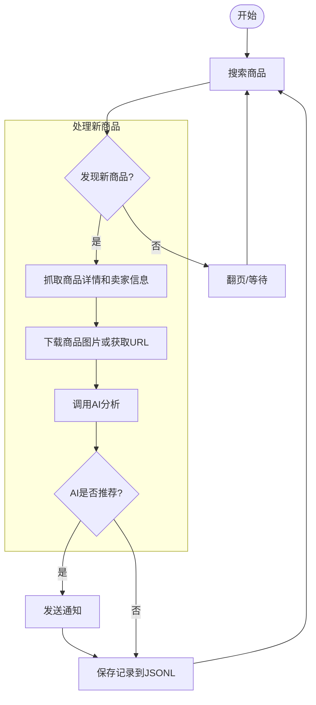
**多维度**：ai会根据collector.py获取回来的数据进行分类分析，再加上定制化需求判断后得出推荐/不推荐结论，最后所有数据存储入jsonl里，并且条件满足就会触发通知渠道。

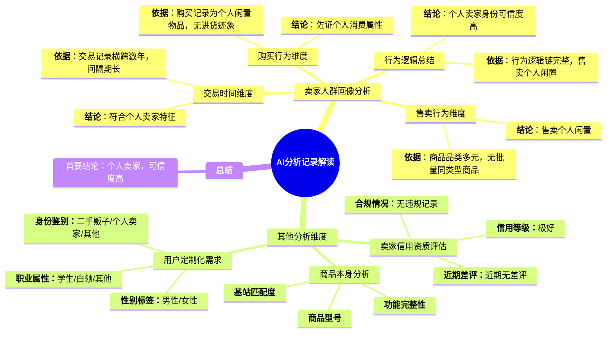


# 🚀 快速部署

## 🐳Docker部署（推荐）

使用 Docker 可以将应用及其所有依赖项打包到一个标准化的单元中，实现快速、可靠和一致的部署。

docker项目地址
  - https://hub.docker.com/r/banbanzhige/ai-goofish-monitor-qb
  


**使用docker compose开箱即用**:

  - 提前下载`.env.example`并改名成`.env`放在`/工作文件夹根目录`下或者手动填入`.env.example`内的参数到你自己创建的`.env`文件内
  - 提前在`/工作文件夹根目录/config/`内创建空的`config.json`文件，以持久化管理你的监控任务
  - 推荐下载`/prompts/base_prompt.txt`，并挂载`/app/prompts`卷，提前创建好`/工作目录文件夹/prompts`文件夹并且复制一份`base_prompt.txt`在你的`/prompts`内，不挂载不影响正常使用，但是每次更新自定义的prompt内容会消失，如无需求可以不需要挂载。

```yaml
services:
 app:
   image: banbanzhige/ai-goofish-monitor-qb:latest
   container_name: ai-goofish-monitor-qb
   pull_policy: always
   ports:
     - "8001:8000"
   volumes:
     - ./.env:/app/.env
     - ./config/config.json:/app/config.json
     - ./logs:/app/logs
     - ./jsonl:/app/jsonl
     - ./images:/app/images
     - ./criteria:/app/criteria
     - ./requirement:/app/requirement
   # - ./prompts:/app/prompts 
   restart: unless-stopped

```


  


## 💻 Windows部署

### 1. 拉取项目代码

  - **需要自行准备 ：python 3.8+的环境，并且配置好path变量**

  - 方式1：直接点击code-[download ZIP](https://github.com/banbanzhige/ai-goofish-monitor-QB/archive/refs/heads/master.zip)下载

  - 方式2：git拉取
  ```PowerShell
  git clone https://github.com/banbanzhige/ai-goofish-monitor-QB.git
  cd banbanzhige/ai-goofish-monitor-QB
  ```

  


### 2. 启动Web管理界面与后端代码

- 方式1：解压后双击打开`start_web_server.bat`启动(推荐)
- 方式2：在根目录用PowerShell终端打开

```PowerShell
# 1. 获取PowerShell执行权限（首次执行即可，后续跳过）
Set-ExecutionPolicy RemoteSigned -Scope CurrentUser

# 2. 创建虚拟环境
python -m venv venv

# 3. 激活虚拟环境
.\venv\Scripts\Activate.ps1

# 4. 安装requirements.txt中的依赖
pip install -r requirements.txt
# . 启动主程序
python web_server.py
```


  - `start_web_server.bat`会自行创建虚拟环境，安装依赖，检测端口，并且自行启动`web_server.py`

  

### 3. 使用前需要提前准备好的内容

- 需要在web界面中系统设置中直接配置环境的变量
  · 视觉大模型的ai API调用token
  · 通知渠道token
  · 闲鱼账号


# 📋 快速开始

### 1. 打开Web管理界面
部署完成后
在浏览器中访问：http://localhost:8000 （若端口冲突可以在`.env`配置端口号）

- 默认登录用户名：**admin**
- 默认登录密码：**admin123**

### 2. 登录咸鱼账号

- 方式一：在WEB管理界面右上角使用自动登录（推荐）
**注意：docker用户无法使用此功能，建议使用方式二获取**
  - 程序自动打开咸鱼首页
  - 在咸鱼首页扫码登录
  - 登录完成后会自动刷新获取cookie，请不要手动关闭网页
  - 获取登录信息完成后网页会自动关->登录成功


<details>
<summary>方式二：在线获取Chrome插件获取登录信息</summary>

-    1.在您的个人电脑上，使用Chrome浏览器安装[闲鱼登录状态提取扩展](https://chromewebstore.google.com/detail/xianyu-login-state-extrac/eidlpfjiodpigmfcahkmlenhppfklcoa)
-    2.打开并登录闲鱼官网
-    3.登录成功后，点击浏览器工具栏中的扩展图标
-    4.点击"提取登录状态"按钮获取登录信息
-    5.点击"复制到剪贴板"按钮
-    6.将复制的内容粘贴到Web UI中保存即可
</details>

<details>
<summary>方式三：本地安装Chrome插件获取登录信息</summary>

-    1. 打开Chrome浏览器
-    2. 访问chrome://extensions/
-    3. 开启"开发者模式"
-    4. 点击"加载已解压的扩展程序"
-    5. 选择chrome-extension/目录
</details>


### 3. 配置系统配置
  默认配置存储在工作路径下的`.env`文件内，可以直接配置，前后端保存同步
  #### AI模型配置 
  - API Key *：你的AI模型服务商提供的API Key
  - API Base URL *：AI模型的API接口地址，必须兼容OpenAI格式
  - 模型名称 *：你要使用的具体模型名称，必须支持图片分析（推荐doubao-seed模型）

  #### Prompt 管理
  - 使用默认即可，熟悉相关的知识可以根据模板自行新建编辑，不推荐直接改动模板

  #### 通用配置
  - 保持默认即可，可以根据模型调整需求，默认配置满足大部分模型和场景
  - **发送URL格式图片：如果模型允许尽量开启这个，能节省大理IO资源，节省大量模型api运算消耗token，未勾选时使用base64编码格式发送图片，相比直接发送URL可能增加的token消耗多300%或以上。**
  #### 服务器端口
  - 默认即可
  #### Web服务用户名

- 默认登录用户名：**admin**
- 默认登录密码：**admin123**

### 4. 🔔配置通知
支持以下通知渠道：
1. **Ntfy**
2. **Gotify**
3. **Bark**
4. **企业微信机器人**
5. **企业微信应用**
6. **Telegram**
7. **Webhook**

- 按web指提交引渠道的配置URL或密钥保存即可，这部分设置也保存在`.env`内编辑
### 5. 配置监控任务

在Web界面中：
-这部分设置保存在`config.json`中
1. 点击"任务管理"
2. 点击"创建新任务"
3. 填写任务信息：
   - 任务名称
   - 关键词
   - 价格范围
   - 监控频率（Cron表达式）
   - 核心需求等
4. 保存任务

### 6.生成ai运行标准

- AI标准-点击生成-等待生成完成（可多任务多线程请求）

### 7. 运行监控任务

- 可以手动启动任务
- 或等待定时任务自动执行


### ⏰ Cron表达式

Cron表达式用于配置任务的执行频率，格式：

```
分 时 日 月 周
```

示例：
- `*/30 * * * *`：每30分钟执行一次
- `0 9 * * *`：每天上午9点执行一次
- `0 18 * * 1-5`：每周一至周五下午6点执行一次
- `0 0 */2 * *`:每两小时执行一次

## 📝 日志管理

日志文件存储在`logs/`目录下：
- `scraper.log`：Web服务器日志
- `日期_随机编号.log`：产品信息发送ai请求文件

可以在Web界面中查看和清空日志。

## 📊 结果查看

监控结果以JSONL格式存储在jsonl/目录下，每个文件对应一个任务的结果。

在Web界面的"结果管理"中可以查看和下载结果文件。


## 🏗️ 技术架构
### 后端技术栈
<details>

<summary>点击展开后端技术栈</summary>

- **Python 3.9+**：主要开发语言
- **FastAPI**：Web服务器框架，提供RESTful API
- **Playwright**：浏览器自动化工具，用于商品数据采集
- **APScheduler**：任务调度器，用于定时任务
- **Uvicorn**：ASGI服务器，用于运行FastAPI应用
- **OpenAI API**：AI智能分析功能
- **Pydantic**：数据验证和序列化

</details>

### 前端技术栈
<details>

<summary>点击展开前端技术栈</summary>

- **HTML5/CSS3/JavaScript**：基础前端技术
- **jQuery**：JavaScript库
- **Bootstrap**：UI框架
</details>


### 核心组件

<details>

<summary>点击展开核心组件</summary>

1. **登录模块 (login.py)**：处理咸鱼账号登录，生成登录状态文件（可选，大部分情况下浏览器插件即可满足）
2. **数据收集模块 (collector.py)**：执行商品监控任务，采集商品数据
3. **Web服务器 (web_server.py)**：提供Web管理界面和API
4. **AI分析模块 (src/ai_handler.py)**：利用AI分析商品信息
5. **通知模块 (src/notifier/)**：处理各种通知渠道
6. **配置模块 (src/config.py)**：管理系统配置
7. **任务管理模块 (src/task.py)**：处理任务的增删改查
8. **文件操作模块 (src/file_operator.py)**：处理文件的读写操作

</details>

## 📁 项目结构

<details>

<summary>点击展开项目结构</summary>

```
.
├── ai-goofish-monitor-QB/
│   ├── .env                      # 环境变量配置文件
│   ├── config.json               # 任务配置文件
│   ├── Dockerfile                # Docker配置文件
│   ├── login.py                  # 登录模块
│   ├── prompt_generator.py       # AI Prompt生成工具
│   ├── requirements.txt          # 项目依赖
│   ├── collector.py              # 数据收集模块
│   ├── web_server.py             # Web服务器入口
│   ├── check_env.py              # 环境检查脚本
│   ├── start_web_server.bat      # Windows一键启动脚本
│   ├── 项目规范.md                # 项目开发规范文档
│   ├── 升级.txt                   # 版本升级说明
│   ├── chrome-extension/         # Chrome扩展
│   ├── logo/                     # 项目Logo
│   ├── prompts/                  # AI Prompt模板
│   ├── src/                      # 核心源代码
│   │   ├── __init__.py
│   │   ├── ai_handler.py         # AI分析模块
│   │   ├── config.py             # 配置模块（统一配置管理）
│   │   ├── file_operator.py      # 文件操作模块
│   │   ├── parsers.py            # 解析器模块
│   │   ├── prompt_utils.py       # Prompt工具
│   │   ├── scraper.py            # 数据收集核心
│   │   ├── task.py               # 任务管理
│   │   ├── utils.py              # 工具函数
│   │   ├── version.py            # 版本信息
│   │   ├── notifier/             # 通知模块
│   │   └── web/                  # Web服务器核心模块（重构后）
│   │       ├── main.py           # FastAPI应用入口
│   │       ├── auth.py           # 认证模块
│   │       ├── scheduler.py      # 定时任务调度器
│   │       ├── task_manager.py   # 任务管理接口
│   │       ├── log_manager.py    # 日志管理
│   │       ├── result_manager.py # 结果管理
│   │       ├── settings_manager.py # 设置管理
│   │       ├── notification_manager.py # 通知管理
│   │       ├── ai_manager.py     # AI管理接口
│   │       └── models.py         # 数据模型
│   ├── static/                   # 静态文件
│   ├── templates/                # HTML模板
│   ├── requirement/              # 用户需求文件
│   ├── criteria/                 # AI分析标准
│   ├── logs/                     # 日志文件
│   ├── jsonl/                    # 结果存储
│   └── xianyu_state.json         # 登录状态文件
```
</details>

### 📦 项目依赖


<details>

<summary>点击展开项目依赖</summary>

```
aiofiles==25.1.0
apscheduler==3.11.2
beautifulsoup4==4.14.3
fastapi==0.128.0
httpx==0.28.1
jinja2==3.1.6
lxml==6.0.2
openai==2.14.0
playwright==1.57.0
pydantic==2.12.5
python-dotenv==1.2.1
python-telegram-bot==22.5
requests==2.32.5
selenium==4.39.0
uvicorn==0.40.0
webdriver-manager==4.0.2
```
</details>

## 📄 许可证

MIT License

## 🙏 致谢

<details>

<summary>点击展开致谢</summary>

本项目在开发过程中参考了以下优秀项目，特此感谢：

- [Usagi-org/ai-goofish-monitor](https://github.com/Usagi-org/ai-goofish-monitor)

以及感谢 doubao-seed-code/qwen3-code 等国产模型/工具给新手小白的我提供了便宜便捷且有用的编成助力

</details>

## ⚠️ 注意事项

<details>

<summary>点击注意事项</summary>

- 本项目 90%+ 的代码都由AI生成，包括项目原型以及后续中 ISSUE 中涉及的 PR 。
- 请遵守闲鱼的用户协议和robots.txt规则，不要进行过于频繁的请求，以免对服务器造成负担或导致账号被限制。
- 本项目仅供学习和技术研究使用，请勿用于非法用途。
- 本项目采用 [MIT 许可证](License) 发布，按"现状"提供，不提供任何形式的担保。
- 项目作者及贡献者不对因使用本软件而导致的任何直接、间接、附带或特殊的损害或损失承担责任。
- 如需了解更多详细信息，请查看 [免责声明](DISCLAIMER.md) 文件。

</details>

## 💡 体会

<details>
<summary>点击体会</summary>

- 现阶段由于ai上下文的限制，ai只能提供部分代码的解决方案，无法全局架构，导致项目会逐渐变成一个缝合怪，最后可能会演变成多个ai编译成的屎山代码，让项目重构和再编译十分棘手
- 真正有价值的能力不是会用某个框架，而是理解底层原理，做出正确的技术判断

</details>
