<a href="https://github.com/banbanzhige/ai-goofish-monitor-QB" title="ai-goofish-monitor-QB">
  
</a>

# 咸鱼 AI 智能推荐机器人

> 基于 **Playwright** 与 **AI 多模态模型**的闲鱼智能推荐机器人，采用朴素贝叶斯模型 + AI 人群画像 + AI 视觉判断的**三维加权推荐引擎**，提供完整的 Web 管理界面，自动化过滤商品链接，个性化挑选优质商品，支持多种通知渠道即时触达。

[](License)
[](https://www.python.org/)
[](https://hub.docker.com/r/banbanzhige/ai-goofish-monitor-qb)

---

## 📖 项目简介

本项目脱胎于 [Usagi-org/ai-goofish-monitor](https://github.com/Usagi-org/ai-goofish-monitor)，经过大量优化升级，在原有基础上引入：
- **朴素贝叶斯网络模型**：卖家信用、评价、交易时长等多维度先验计算
- **AI 多模态视觉模型**：商品图片质量、成色、真实性智能分析
- **人群画像识别**：卖家身份、职业、性别等个性化标签判断
- **三维加权评分体系**：贝叶斯（40%）+ 视觉AI（35%）+ 置信度（25%）融合推荐
- **全面UI/UX重构**：响应式设计，支持 PC / 平板 / 移动端多端管理

> [!IMPORTANT]
> - **本项目仅供学习和技术研究使用，请勿用于非法用途**
> - 请遵守闲鱼平台的用户协议和 robots.txt 规则，避免过于频繁的请求

---

## ✨ 核心特性

### 🎯 智能推荐引擎
- **三维评分体系**：贝叶斯先验模型 + AI 视觉分析 + 置信度判断，多角度保障推荐质量
- **个性化需求定制**：每个任务可独立配置 AI 分析指令（Prompt），支持自然语言描述需求
- **透明评分机制**：详细的评分计分板，AI 推荐逻辑可视化，决策过程清晰透明

### 🖥️ Web 管理界面
- **响应式设计**：完美适配 PC、平板、移动端，提供直观清晰的可视化界面
- **移动端优化**：卡片式布局，支持触控长按拖拽排序，操作顺滑流畅
- **实时监控**：任务状态、日志查询、结果管理一目了然

### 🔍 高级监控功能
- **精准筛选条件**：支持验货宝、验号担保、包邮、新发布时间、区域三级联动等 6+ 筛选维度
- **多任务并发**：支持配置多个监控任务，每个任务独立关键词、价格范围、AI 标准
- **定时任务调度**：灵活的 Cron 表达式配置，自定义监控频率

### 👥 多账号管理
- **账号池管理**：支持添加、编辑、删除多个咸鱼账号
- **智能切换**：风控检测自动切换账号，保证任务续航能力
- **状态监控**：Cookie 有效性实时检测，定期自动检查（每 5 分钟）

### 🔔 多渠道通知
支持 **8 种**主流通知渠道：
- 企业微信（群机器人 / 应用消息）
- 钉钉机器人（加签验证 + ActionCard 图文卡片）
- Telegram
- Ntfy / Gotify / Bark
- 自定义 Webhook

### 💰 成本优化
- **Token 消耗优化**：支持发送 URL 格式图片，大幅降低 Token 使用量
- **成本可控**：以豆包 1.8 模型为例，20 个产品分析约 **0.2元人民币**

---

## 📸 界面展示

<div align="center" style="margin: 2em 0;">
  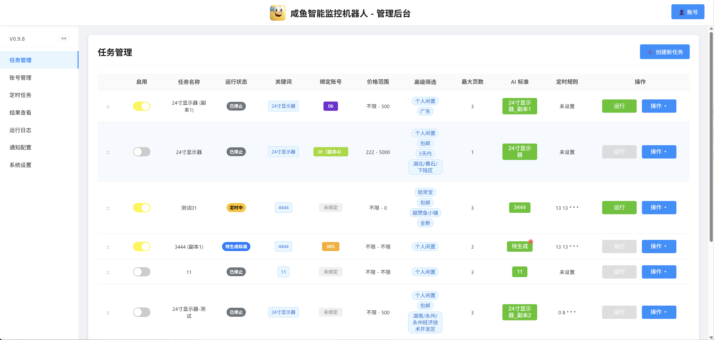
  <p style="font-size: 0.9em; color: #555; margin-top: 0.5em;">
    任务管理界面 - 支持高级筛选、拖拽排序、批量操作
  </p>
</div>

| 结果管理界面 | AI 评分详情 |
|:---:|:---:|
| 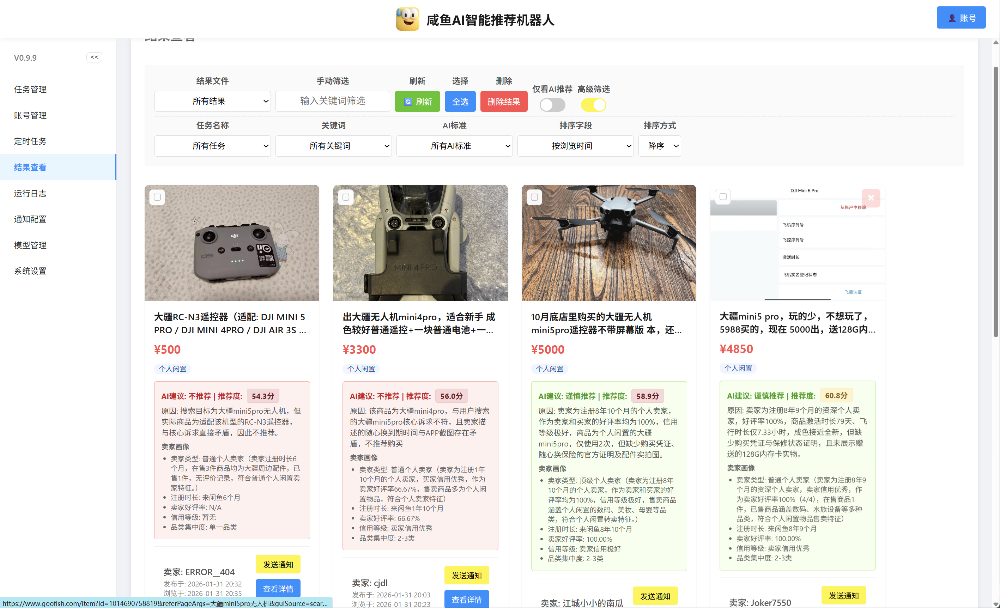 | 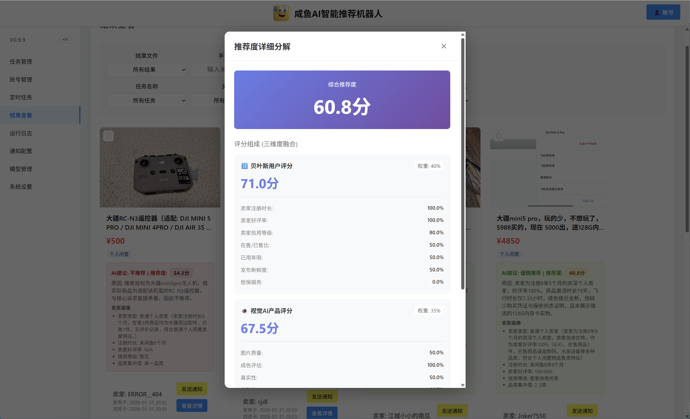 |

<details>
<summary>📱 移动端界面展示</summary>

| 账号管理 | 任务管理 | 结果查看 | 定时任务 |
|:---:|:---:|:---:|:---:|
| 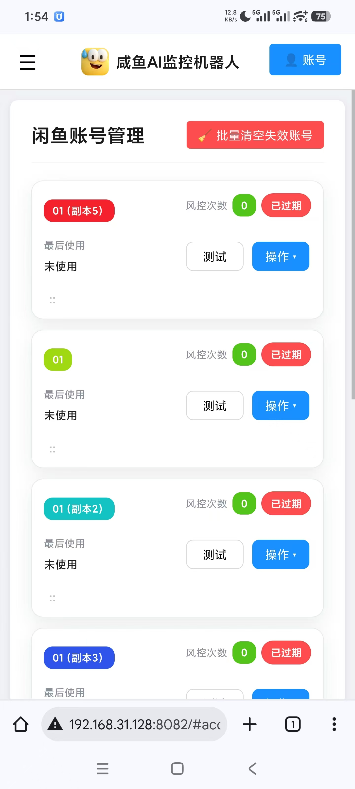 | 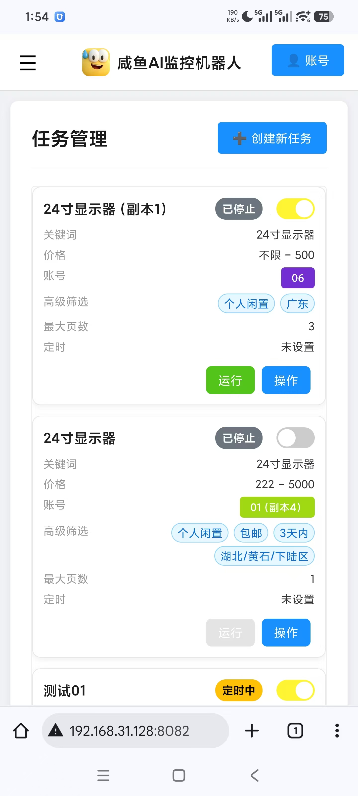 | 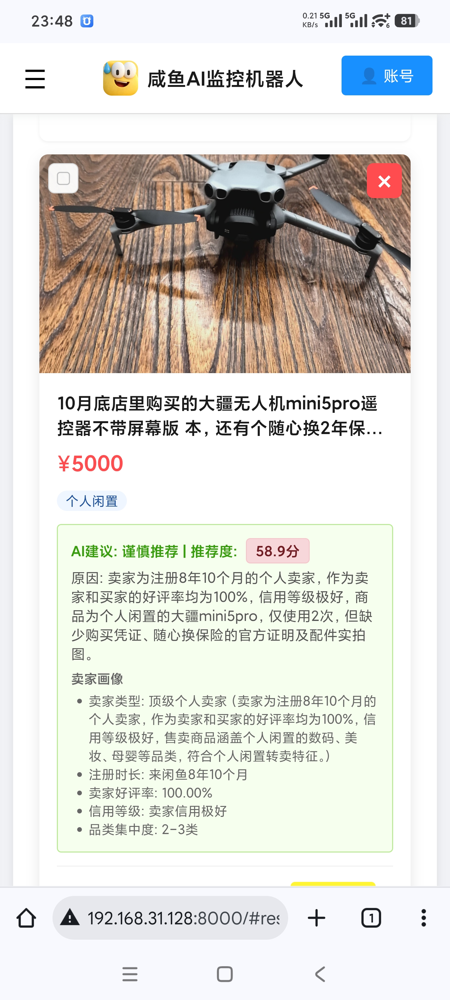 | 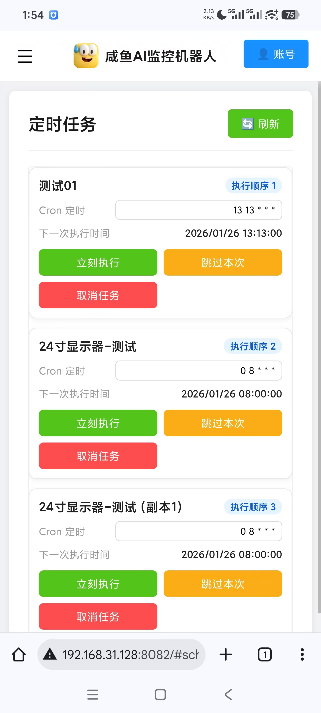 |

</details>

<details>
<summary>🔧 其他界面展示</summary>

| 账号管理界面 | 定时任务界面 |
|:---:|:---:|
| 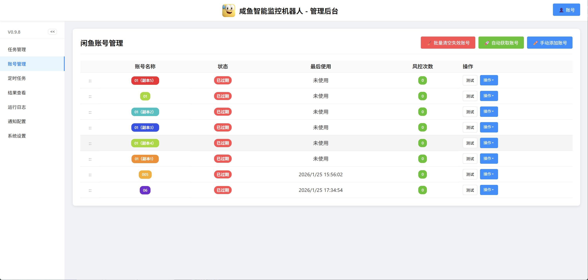 | 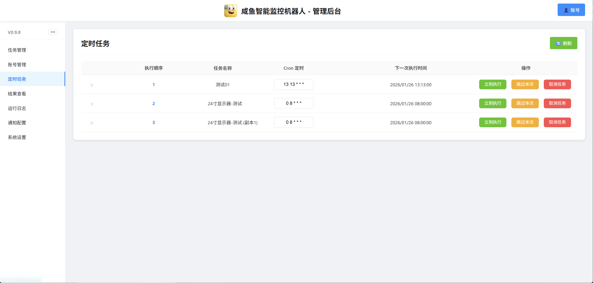 |

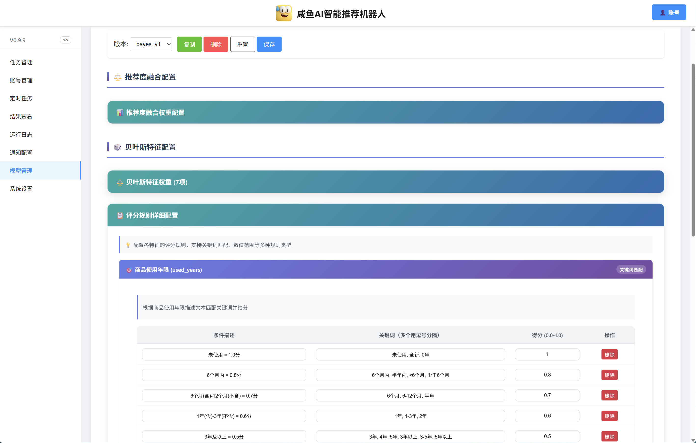

</details>

---

## 🆕 版本更新

### v0.9.9 (2026-01-31) - 推荐引擎升级

> [!WARNING]
> **本次更新 AI 分析能力大幅增强，必须设置模型输出 Token 上限**  
> 大部分模型支持比默认更高的输出字段，推荐设置 **10000** 起，详见 [上限设置与判断](#如何判断你的-ai-api-默认输出-token-上限是否足够)

- ✅ **推荐引擎重构**：朴素贝叶斯（40%）+ AI 视觉（35%）+ 置信度（25%）三维融合评分
- ✅ **Token 上限解锁**：新增 API 输出 Token 上限字段配置
- ✅ **多模态功能强化**：AI 视觉模型在推荐和评分中发挥核心作用
- ✅ **贝叶斯模型管理**：新增独立管理 Tab，支持细致定制筛选参数
- ✅ **代理设置优化**：模型和渠道支持独立代理开关
- ✅ **Cookie 稳定性提升**：优化 Cookie 失效问题，新增回填功能
- ✅ **Prompt 模板更新**：适配 0.9.9 版本推荐工作流

<details>
<summary>📋 历史版本更新日志</summary>

### v0.9.8 (2026-01-25) - UI/UX 全面升级
- ✅ **高级筛选焕新**：胶囊标签开关，新增 6 项筛选（验货宝、验号担保、超赞鱼小铺等）
- ✅ **移动端适配**：卡片式布局，触控长按拖拽排序，安全边距优化
- ✅ **批量操作**：结果数据批量删除、过期账号批量清理
- ✅ **前后端贯通**：筛选条件同步至爬虫逻辑，旧任务自动补充默认值

### v0.9.7 (2026-01-18) - 多账号管理系统
- ✅ **多账号管理**：账号池增删改查，支持从当前登录一键导入
- ✅ **账号绑定任务**：任务创建时选择账号，风控自动切换
- ✅ **自定义登录页**：替代 Basic Auth，Cookie Session 方案，7 天免登录
- ✅ **钉钉通知渠道**：支持加签验证和 ActionCard 图文卡片
- ✅ **定时任务增强**：独立管理界面，支持立即执行/跳过一轮

### v0.9.6 (2026-01-16) - 定时任务系统
- ✅ **定时任务管理**：独立列表，显示执行顺序和下次执行时间
- ✅ **Cron 在线编辑**：列表内直接修改，自动同步任务配置
- ✅ **灵活任务控制**：跳过本次、立即执行、取消任务
- ✅ **项目架构重构**：web_server.py 拆分为 9 个独立模块

</details>

---

## 🚀 核心工作流程

### 推荐引擎架构

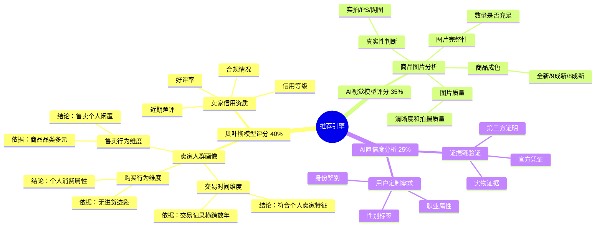

### 任务执行流程

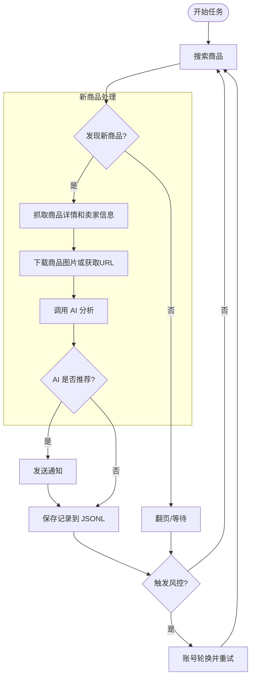

### 评分融合算法

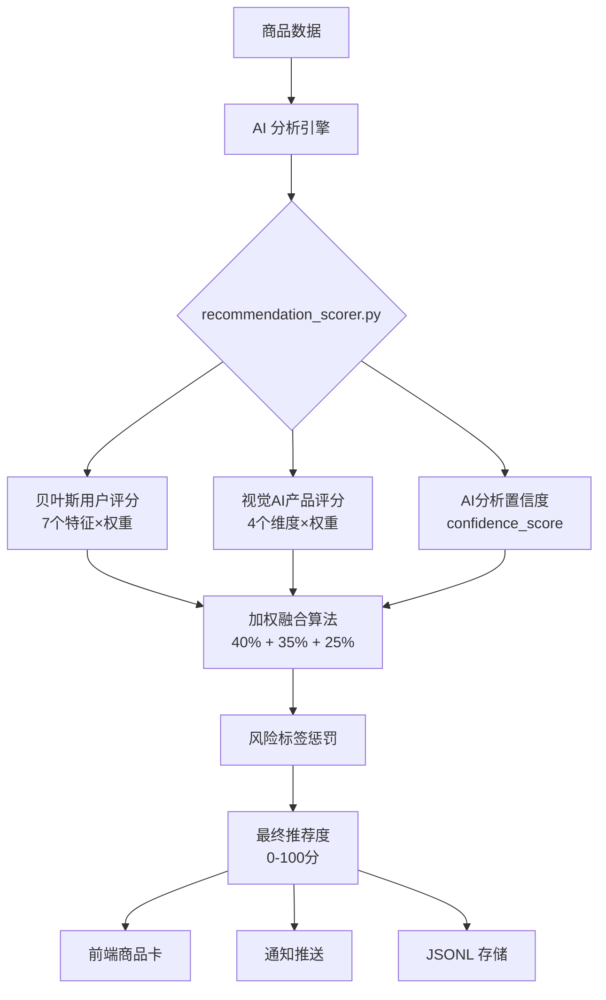

---

## 🚀 快速部署

### 🐳 Docker 部署（推荐）

Docker 提供标准化部署环境，实现开箱即用。

**镜像地址**
- 主站：`banbanzhige/ai-goofish-monitor-qb:latest`
- 备用：`ghcr.io/banbanzhige/ai-goofish-monitor-qb:latest`
- 支持架构：**AMD64** / **ARM64**

**方式一：Docker Compose（推荐）**

> [!NOTE]
> - 提前下载 [`.env.example`](.env.example) 并重命名为 `.env`，填写必要配置
> - 在 `/工作目录/config/` 下创建空的 `config.json` 文件
> - **重要**：0.9.9 版本更新了 `prompts` 文件夹，旧用户**必须**重新拉取 `prompts` 目录下所有文件

```yaml
services:
  app:
    image: banbanzhige/ai-goofish-monitor-qb:latest
    container_name: ai-goofish-monitor-qb
    pull_policy: always
    ports:
      - "8001:8000"
    volumes:
      - ./.env:/app/.env
      - ./config/config.json:/app/config.json
      - ./logs:/app/logs
      - ./jsonl:/app/jsonl
      - ./criteria:/app/criteria
      - ./requirement:/app/requirement
      # - ./prompts:/app/prompts  # 可选：自定义 prompts
      # - ./state:/app/state      # 可选：账号状态持久化
    restart: unless-stopped
```

启动命令：
```bash
docker-compose up -d
```

**方式二：Docker 命令行**
```bash
# 主站拉取
docker pull banbanzhige/ai-goofish-monitor-qb:latest

# 或备用站点
docker pull ghcr.io/banbanzhige/ai-goofish-monitor-qb:latest
```

---

### 💻 Windows 本地部署

**环境要求**
- Python 3.10+
- Node.js + npm（可选，用于前端开发）

#### 方式一：一键启动（推荐）

1. **下载项目**
   - 直接下载：[Download ZIP](https://github.com/banbanzhige/ai-goofish-monitor-QB/archive/refs/heads/master.zip)
   - 或使用 Git：
     ```powershell
     git clone https://github.com/banbanzhige/ai-goofish-monitor-QB.git
     cd ai-goofish-monitor-QB
     ```

2. **双击启动**
   - 双击 `start_web_server.bat`
   - 脚本会自动创建虚拟环境、安装依赖、检测端口并启动服务

   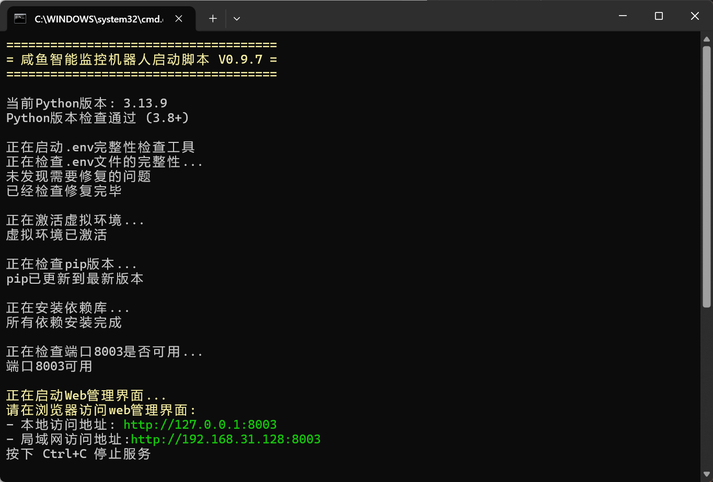

#### 方式二：手动启动

```powershell
# 1. 获取 PowerShell 执行权限（首次执行）
Set-ExecutionPolicy RemoteSigned -Scope CurrentUser

# 2. 创建虚拟环境
python -m venv venv

# 3. 激活虚拟环境
.\venv\Scripts\Activate.ps1

# 4. 安装依赖
pip install -r requirements.txt

# 5. 启动服务
python web_server.py
```

---

## 📋 快速开始

### 前置准备

| 配置项 | 说明 | 必需 |
|--------|------|------|
| `OPENAI_API_KEY` | AI 模型 API Key | ✅ |
| `OPENAI_BASE_URL` | API 接口地址（兼容 OpenAI 格式） | ✅ |
| `OPENAI_MODEL_NAME` | 多模态模型名称（如 `gpt-4o`、`doubao-seed-1-8-251228`） | ✅ |
| `tokens上限字段名` | Token 输出上限字段（豆包：`max_completion_tokens`，OpenAI：`max_tokens`） | ✅ |
| `tokens上限` | **v0.9.9 必须设置**，推荐 **10000** 起 | ✅ |
| `闲鱼账号` | 手机扫码 或 [Chrome 插件](https://chromewebstore.google.com/detail/xianyu-login-state-extrac/eidlpfjiodpigmfcahkmlenhppfklcoa) 获取 | ✅ |
| `通知渠道 Token` | 企业微信、Telegram、钉钉等（可选） | ❌ |

---

### 1️⃣ 访问 Web 管理界面

部署完成后，浏览器访问：`http://localhost:8000`（可在 `.env` 修改端口）

- 默认用户名：**admin**
- 默认密码：**admin123**

---

### 2️⃣ 获取咸鱼账号

<details open>
<summary><b>方式一：Web 界面自动登录（推荐）</b></summary>

> [!WARNING]
> Docker 用户可能无法使用此功能，建议使用方式二

1. 点击右上角"自动登录"按钮
2. 程序自动打开咸鱼首页
3. 扫码登录（**请勿手动关闭网页**）
4. 自动获取 Cookie 完成后网页关闭
5. 填写账号名称保存

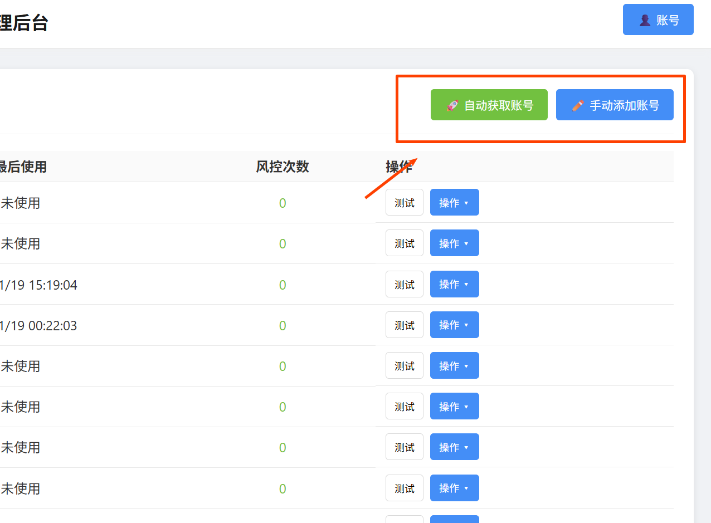

</details>

<details open>
<summary><b>方式二：Chrome 插件获取（推荐 Docker 用户）</b></summary>

1. 安装 [闲鱼登录状态提取扩展](https://chromewebstore.google.com/detail/xianyu-login-state-extrac/eidlpfjiodpigmfcahkmlenhppfklcoa)
2. 打开并登录 [闲鱼官网](https://www.goofish.com/)
3. 点击浏览器扩展图标 → "提取登录状态"
4. 点击"复制到剪贴板"
5. 粘贴到 Web UI 并保存

</details>

<details>
<summary><b>方式三：本地安装插件</b></summary>

1. Chrome 浏览器访问 `chrome://extensions/`
2. 开启"开发者模式"
3. 点击"加载已解压的扩展程序"
4. 选择项目中的 `chrome-extension/` 目录
5. 重复方式二步骤

</details>

---

### 3️⃣ 配置系统参数

推荐在 **Web 界面**直接填写配置（前后端自动同步到 `.env`）

#### AI 模型配置

| 字段 | 说明 |
|------|------|
| **API Key** | AI 服务商提供的密钥 |
| **API Base URL** | API 接口地址，必须兼容 OpenAI 格式 |
| **模型名称** | 必须支持图片分析（推荐 `doubao-seed-1-8-251228`） |
| **Token 上限字段名** | **v0.9.9 必须设置**，豆包：`max_completion_tokens` / OpenAI：`max_tokens` |
| **Token 上限** | **v0.9.9 必须设置**，推荐 **10000** 起 |

#### 如何判断你的 AI API 默认输出 Token 上限是否足够

使用默认 `base_prompt` 生成一次 AI 标准，检查输出最底部：

| ❌ 被截断的 AI 标准 | ✅ 完整的 AI 标准 |
|:---:|:---:|
| 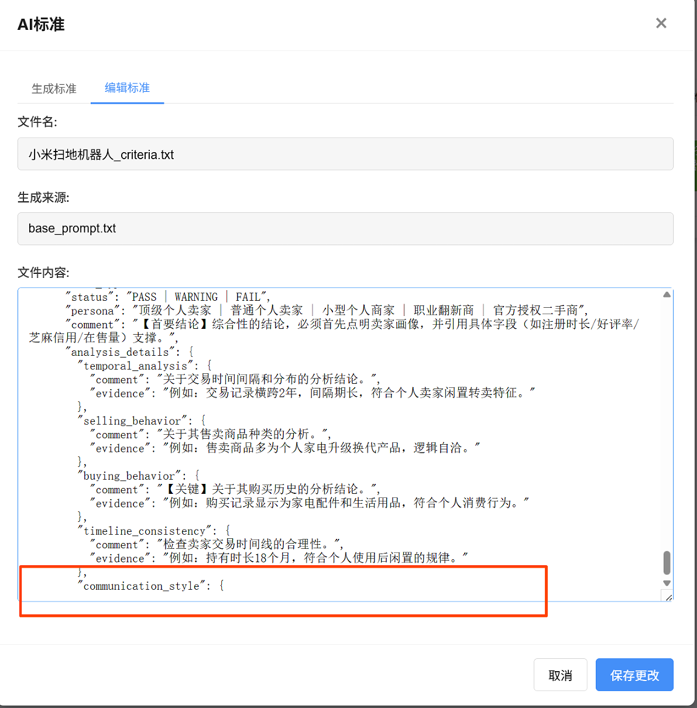 | 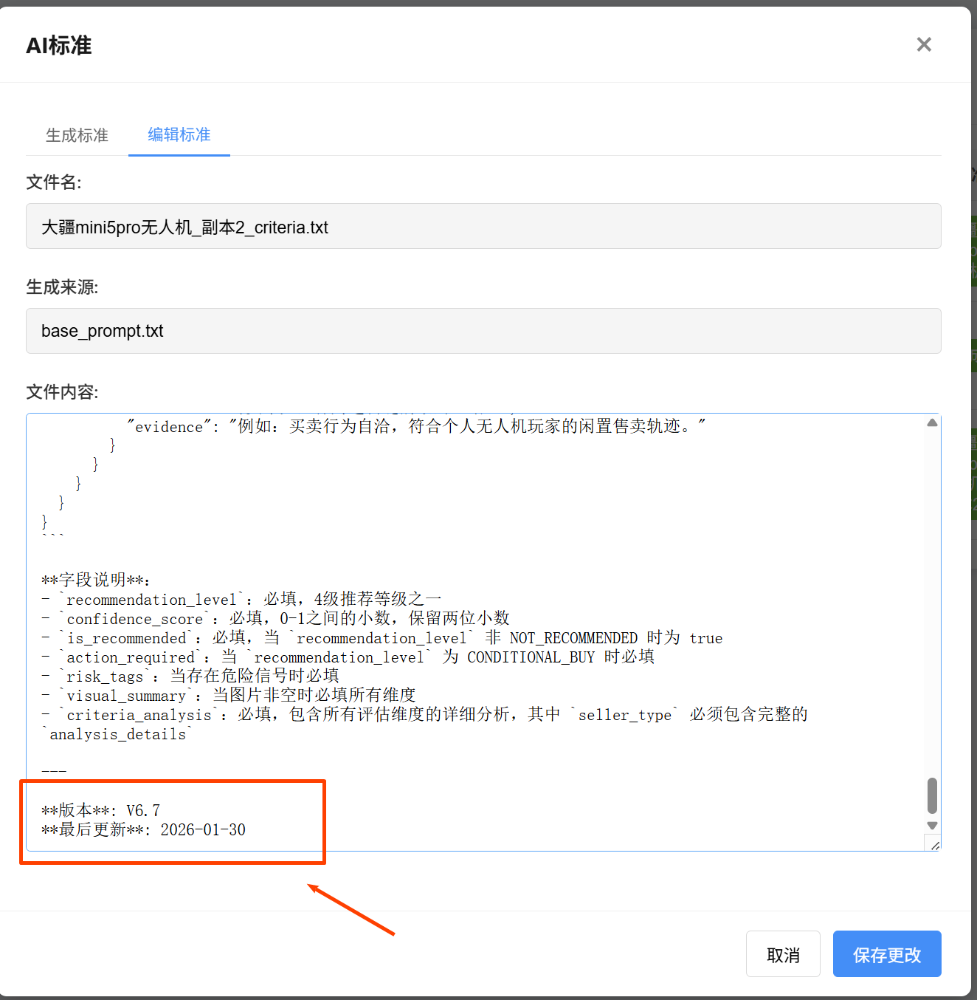 |

**判断标准**：如果存在时间戳 → 输出完整；否则 → 被截断，需增加 Token 上限

#### Prompt 管理
- 使用默认即可，熟悉 Prompt 工程可自行新建编辑
- 不推荐直接改动模板，建议复制后修改

#### Bayes 配置
- 详见 `prompts/guide/bayes_guide.md`
- 可调整权重、先验参数等

#### 通用配置
- 保持默认即可，可根据模型调整

#### 服务器端口
- 默认 `8000`，可在 `.env` 修改 `SERVER_PORT`

#### Web 登录凭证
- 默认用户名：`admin`
- 默认密码：`admin123`
- 可在 `.env` 修改 `WEB_USERNAME` 和 `WEB_PASSWORD`

---

### 4️⃣ 配置通知渠道

在 **通知配置** 页面按提示填写各渠道的 URL 或密钥：

- 企业微信机器人 / 应用
- 钉钉机器人（支持加签）
- Telegram
- Ntfy / Gotify / Bark
- 自定义 Webhook

配置保存在 `.env` 文件中

---

### 5️⃣ 创建监控任务

在 **任务管理** 页面：

1. 点击"创建新任务"
2. 填写任务信息：
   - 任务名称
   - 关键词（如"iPad"、"switch"）
   - 价格范围（如 100-500）
   - 监控频率（Cron 表达式）
   - 高级筛选（验货宝、区域、发布时间等）
   - 核心需求（AI 个性化要求）
   - 绑定账号（可选）
3. 保存任务

任务配置自动保存到 `config.json`

---

### 6️⃣ 生成 AI 运行标准

- 在任务列表点击 **"AI 标准"** → **"生成"**
- 等待生成完成（支持多任务并发）
- 预览生成的标准，确认无误

---

### 7️⃣ 运行监控任务

- **手动启动**：点击任务卡片的"启动"按钮
- **定时执行**：等待定时任务自动触发

---

## ⏰ Cron 表达式说明

Cron 表达式用于配置任务执行频率，格式：

```
分 时 日 月 周
```

| 表达式 | 说明 |
|--------|------|
| `*/30 * * * *` | 每 30 分钟执行一次 |
| `0 9 * * *` | 每天上午 9 点执行 |
| `0 18 * * 1-5` | 周一至周五下午 6 点执行 |
| `0 */2 * * *` | 每 2 小时执行一次 |
| `0 0 * * *` | 每天凌晨 0 点执行 |

**在线生成工具**：[crontab.guru](https://crontab.guru/)

---

## 💰 Token 消耗优化

<details>
<summary><b>1. Token 消耗优化方案</b></summary>

本项目对 AI API 的 Token 使用进行了深度优化：

- **启用 URL 格式图片**：模型支持的情况下，发送图片 URL 而非 Base64 编码
- **大幅降低成本**：Token 使用量可降低 **60%-80%**


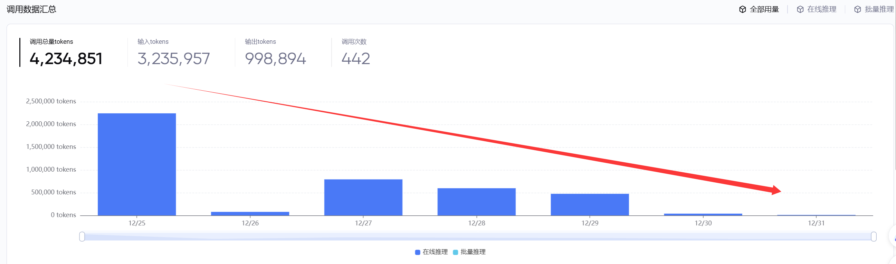

</details>

<details>
<summary><b>2. Token 消耗预期</b></summary>

以 **豆包 1.8 模型**为例（截止 2026-01-06 测算）：

- **20 个产品分析**：约 **0.2 元人民币**
- **单个产品分析**：约 **0.01 元**


成本控制十分可观，适合长期监控使用。

</details>

---

## 🔔 通知渠道配置

支持以下 **8 种**主流通知渠道：

1. **企业微信群机器人**：图文消息 + Markdown
2. **企业微信应用消息**：企业内部推送
3. **钉钉机器人**：支持加签验证 + ActionCard 图文卡片
4. **Telegram**：支持图片 + 文本消息
5. **Ntfy**：轻量级推送服务
6. **Gotify**：自托管推送服务
7. **Bark**：iOS 推送服务
8. **Webhook**：自定义 HTTP 推送

根据 **通知配置** 页面的示例填写配置即可。

---

## 📝 日志管理

日志文件存储在 `logs/` 目录下：

- `scraper.log`：Web 服务器日志
- `日期_随机编号.log`：AI 分析请求日志

在 **运行日志** 页面可查看和清空日志，支持选择展示条数（100/200/500/1000）。

---

## 📊 结果查看

监控结果以 **JSONL** 格式存储在 `jsonl/` 目录下，每个文件对应一个任务。

在 **结果管理** 页面可以：
- 查看商品详情和 AI 评分
- 筛选推荐/不推荐商品
- 手动发送通知
- 批量删除结果
- 下载结果文件

---

## 🏗️ 技术架构

### 后端技术栈

<details>
<summary>点击展开后端技术栈</summary>

- **Python 3.10+**：主要开发语言
- **FastAPI**：高性能 Web 框架，提供 RESTful API
- **Playwright**：浏览器自动化工具，商品数据采集
- **APScheduler**：任务调度器，定时任务管理
- **Uvicorn**：ASGI 服务器，运行 FastAPI 应用
- **OpenAI API**：AI 智能分析接口
- **Pydantic**：数据验证和序列化
- **NumPy**：贝叶斯模型计算

</details>

### 前端技术栈

<details>
<summary>点击展开前端技术栈</summary>

- **HTML5 / CSS3 / JavaScript**：基础前端技术
- **jQuery**：轻量级 JavaScript 库
- **Bootstrap**：响应式 UI 框架
- **模块化设计**：功能拆分至 `static/js/modules/`

</details>

### 核心组件

<details>
<summary>点击展开核心组件</summary>

1. **服务启动入口** (`web_server.py`)：启动 FastAPI 服务与任务调度
2. **任务执行入口** (`collector.py`)：加载任务配置，驱动监控流程
3. **采集与解析** (`src/scraper.py`, `src/parsers.py`)：商品抓取、字段解析
4. **AI 分析与推荐** (`src/ai_handler.py`, `src/bayes.py`, `src/recommendation_scorer.py`)：AI 判定与融合评分
5. **Web 服务核心** (`src/web/`)：
   - `main.py`：FastAPI 应用入口
   - `auth.py`：认证模块（Cookie Session）
   - `scheduler.py`：定时任务调度器
   - `task_manager.py`：任务管理接口
   - `log_manager.py`：日志管理
   - `result_manager.py`：结果管理
   - `settings_manager.py`：配置管理
   - `notification_manager.py`：通知管理
   - `ai_manager.py`：AI 管理接口
   - `account_manager.py`：账号管理接口
   - `bayes_api.py`：贝叶斯配置接口
   - `models.py`：数据模型
6. **通知模块** (`src/notifier/`)：处理各种通知渠道
7. **配置模块** (`src/config.py`)：统一管理系统配置
8. **登录模块** (`login.py`)：咸鱼账号登录（可选）
9. **Prompt 工具** (`src/prompt_utils.py`)：Prompt 模板管理
10. **版本管理** (`src/version.py`)：项目版本信息

</details>

---

## 📁 项目结构

<details>
<summary>点击展开项目结构</summary>

```
ai-goofish-monitor-QB/
├── .env                      # 环境变量配置（需用户创建）
├── .env.example              # 环境变量配置示例
├── config.json               # 任务配置（自动生成）
├── Dockerfile                # Docker 配置
├── docker-compose.yaml       # Docker Compose 配置
├── .dockerignore             # Docker 忽略文件
├── login.py                  # 登录模块
├── prompt_generator.py       # AI Prompt 生成工具
├── requirements.txt          # Python 依赖
├── collector.py              # 任务执行入口
├── web_server.py             # Web 服务器入口
├── check_env.py              # 环境检查脚本
├── start_web_server.bat      # Windows 一键启动脚本
├── README.md                 # 项目说明文档
├── License                   # MIT 许可证
├── DISCLAIMER.md             # 免责声明
├── AGENTS.md                 # 开发规范
├── .gitattributes            # Git 属性配置
├── .gitignore                # Git 忽略文件
│
├── chrome-extension/         # Chrome 扩展（登录状态提取器）
│
├── images/                   # 项目图片资源
│   ├── Example/              # 示例截图
│   └── logo/                 # Logo 与 Banner
│
├── prompts/                  # AI Prompt 与 Bayes 配置
│   ├── base_prompt.txt       # 基础 Prompt 模板
│   ├── bayes/
│   │   └── bayes_v1.json     # 贝叶斯模型配置
│   └── guide/
│       ├── bayes_guide.md    # 贝叶斯配置指南
│       └── weight_framework_guide.md
│
├── src/                      # 核心源代码
│   ├── __init__.py
│   ├── ai_handler.py         # AI 分析模块
│   ├── bayes.py              # 贝叶斯模型
│   ├── config.py             # 配置模块（统一配置管理）
│   ├── file_operator.py       # 文件操作模块
│   ├── parsers.py            # 解析器模块
│   ├── prompt_utils.py       # Prompt 工具
│   ├── recommendation_scorer.py # 推荐度评分融合
│   ├── scraper.py            # 数据采集核心
│   ├── task.py               # 任务管理
│   ├── utils.py              # 工具函数
│   ├── version.py            # 版本信息
│   │
│   ├── notifier/             # 通知模块
│   │   ├── __init__.py
│   │   ├── base.py           # 通知基类
│   │   ├── channels.py       # 通知渠道实现
│   │   └── config.py         # 通知配置
│   │
│   └── web/                  # Web 服务核心（重构后）
│       ├── main.py           # FastAPI 应用入口
│       ├── auth.py           # 认证模块（Cookie Session）
│       ├── scheduler.py      # 定时任务调度器
│       ├── task_manager.py   # 任务管理接口
│       ├── log_manager.py    # 日志管理
│       ├── result_manager.py # 结果管理
│       ├── settings_manager.py # 配置管理
│       ├── notification_manager.py # 通知管理
│       ├── ai_manager.py     # AI 管理接口
│       ├── account_manager.py # 账号管理接口
│       ├── bayes_api.py      # 贝叶斯配置接口
│       └── models.py         # 数据模型
│
├── static/                   # 静态文件
│   ├── css/                  # 样式文件
│   │   ├── style.css
│   │   └── bayes_visual.css
│   ├── js/                   # JavaScript 文件
│   │   ├── main.js           # 主入口
│   │   ├── bayes_init.js
│   │   ├── score_modal.js
│   │   └── modules/          # 前端模块拆分
│   │       ├── api.js
│   │       ├── app_interactions.js
│   │       ├── app_state.js
│   │       ├── accounts_view.js
│   │       ├── bayes_visual_manager.js
│   │       ├── logs_view.js
│   │       ├── navigation.js
│   │       ├── notifications_view.js
│   │       ├── region.js
│   │       ├── render.js
│   │       ├── reorder.js
│   │       ├── results_view.js
│   │       ├── settings_view.js
│   │       ├── tasks_editor.js
│   │       ├── templates.js
│   │       └── ui_shell.js
│   └── china/                # 省市区三级联动数据
│       └── index.json
│
├── templates/                # HTML 模板
│   ├── index.html            # 主界面
│   └── login.html            # 登录页面
│
├── requirement/              # 用户需求文件（自定义 Prompt）
├── criteria/                 # AI 分析标准（生成的）
├── logs/                     # 日志文件
├── jsonl/                    # 结果存储（JSONL 格式）
├── state/                    # 账号状态文件
├── task_stats/               # 任务统计信息
├── archive/                  # 归档文件
└── venv/                     # Python 虚拟环境（可选）
```

</details>

---

## 📦 项目依赖

<details>
<summary>点击展开项目依赖</summary>

```
uvicorn
fastapi
pydantic
python-dotenv
aiofiles
apscheduler
openai
httpx
beautifulsoup4
lxml
requests
selenium
webdriver-manager
python-telegram-bot
playwright
jinja2
python-multipart
```

完整依赖见 [`requirements.txt`](requirements.txt)

</details>

---

## 📄 许可证

本项目采用 [MIT License](License) 发布。

---

## 🙏 致谢

<details>
<summary>点击展开致谢</summary>

本项目在开发过程中参考了以下优秀项目，特此感谢：

- [Usagi-org/ai-goofish-monitor](https://github.com/Usagi-org/ai-goofish-monitor) - 原始项目，提供了核心思路

感谢 **豆包 Seed Code** / **Qwen3 Code** 等国产 AI 模型，为新手开发者提供了便宜、便捷且强大的编程助力。

</details>

---

## ⚠️ 免责声明与注意事项

<details>
<summary>点击展开注意事项</summary>

> [!CAUTION]
> - 本项目 **90%+ 的代码由 AI 生成**，包括项目原型和后续 PR
> - **仅供学习和技术研究使用，请勿用于非法用途**
> - 请遵守闲鱼平台的用户协议和 `robots.txt` 规则
> - 不要进行过于频繁的请求，以免对服务器造成负担或导致账号被限制
> - 本项目按"现状"提供，不提供任何形式的担保
> - 项目作者及贡献者不对因使用本软件而导致的任何损害或损失承担责任

详细信息请查看 [免责声明](DISCLAIMER.md) 文件。

</details>

---

## 💡 开发体会

<details>
<summary>点击展开开发体会</summary>

- 现阶段由于 AI 上下文限制，AI 只能提供部分代码的解决方案，无法全局架构
- 项目会逐渐变成"缝合怪"，最后可能演变成多个 AI 编译的屎山代码
- 项目重构和再编译十分棘手，需要人工介入梳理架构
- **真正有价值的能力不是会用某个框架，而是理解底层原理，做出正确的技术判断**

</details>

---

## 🔗 相关链接

- [GitHub 仓库](https://github.com/banbanzhige/ai-goofish-monitor-QB)
- [Docker Hub](https://hub.docker.com/r/banbanzhige/ai-goofish-monitor-qb)
- [Chrome 扩展](https://chromewebstore.google.com/detail/xianyu-login-state-extrac/eidlpfjiodpigmfcahkmlenhppfklcoa)
- [Cron 表达式生成器](https://crontab.guru/)

---

## 📮 反馈与贡献

如有问题或建议，欢迎提交 [Issue](https://github.com/banbanzhige/ai-goofish-monitor-QB/issues) 或 [Pull Request](https://github.com/banbanzhige/ai-goofish-monitor-QB/pulls)。

---

<div align="center">

**⭐ 如果这个项目对你有帮助，请给一个 Star 支持一下！**

</div>
